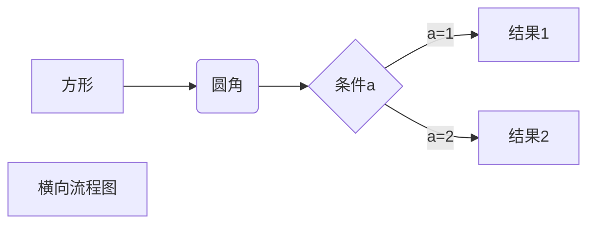
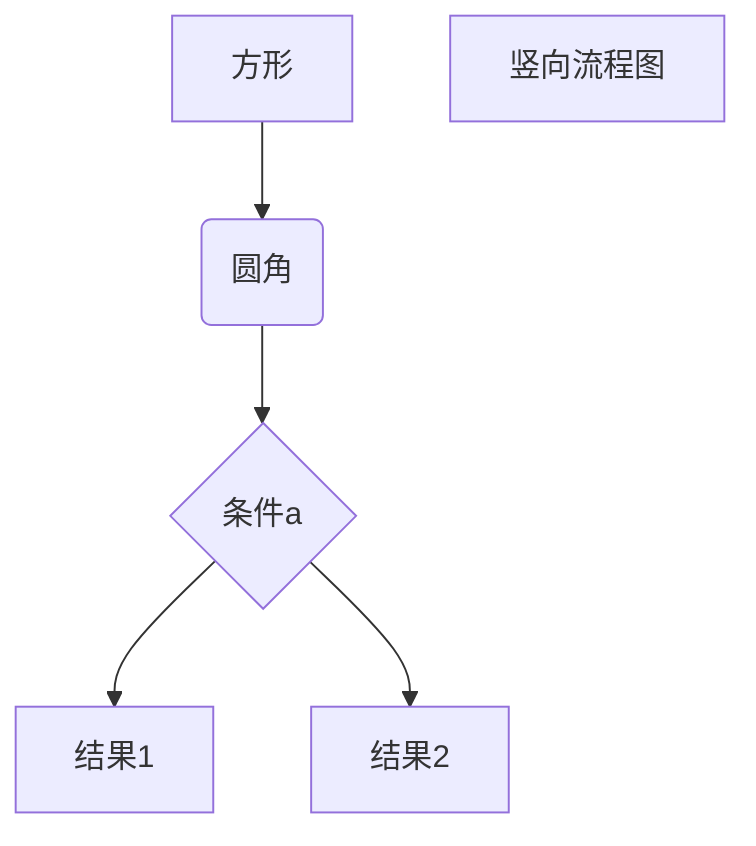
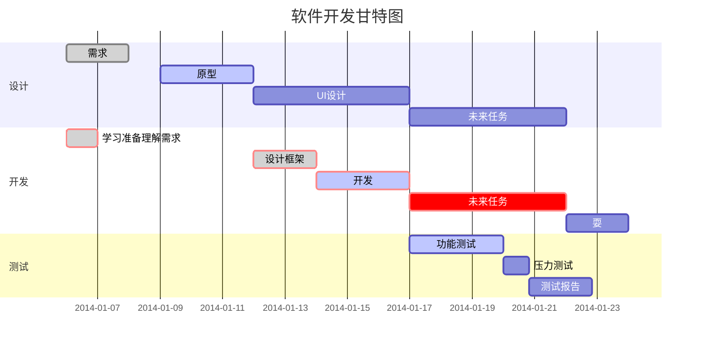

# markdown绘制流程图或甘特图

示例：  
  
更多画法见[官方文档 mkdocs-material/reference/diagrams](https://squidfunk.github.io/mkdocs-material/reference/diagrams/#:~:text=Diagrams%20help%20to%20communicate%20complex%20relationships)
  

